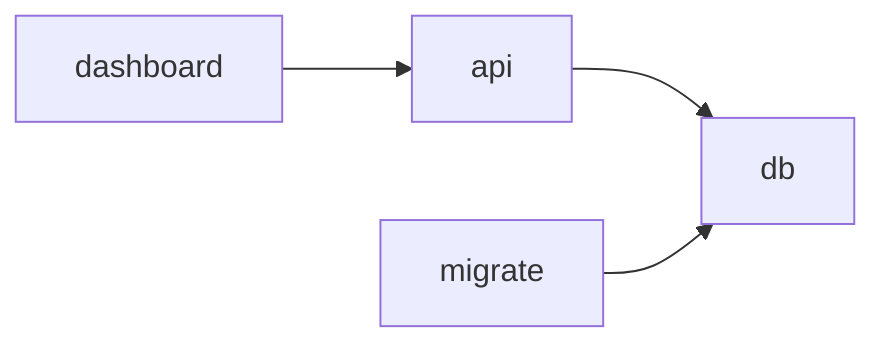

# Building a Node Graph of This System

A self-teaching exercise: draw IMS as a node graph to build a real mental
model of it, instead of only ever working through Claude. This doc is the
method and a starter node inventory — not a finished graph. The value is
in tracing each edge against actual code yourself.

## 1. Pick one "cut" first

A system this size has several valid graphs depending on what edge type
you draw. Pick **one**, finish it, then layer the next on top (or start a
new diagram):

- **Deployment graph** — what containers/processes exist and what talks
  to what over the network (docker-compose services, Tauri desktop/mobile
  clients, Postgres). Easiest to start with — mostly declared in config,
  not scattered across code.
- **Request-flow graph** — for one action (e.g. "create a purchase
  order"), trace the call path: dashboard view → API router → service →
  model/DB. Best for building intuition about how a change ripples.
- **Data-flow graph** — where data is born and where it ends up:
  inventory events → data_lake → feature_store → warehouse/mlruns →
  forecast_service. Most specific to IMS's ML side.
- **Domain/service-dependency graph** — which `app/services/*.py` import
  which other services. Reveals coupling, not runtime behavior.

Recommended order: deployment graph first, then the request-flow graph
for one flow you care about, then data-flow. Merging all four into one
diagram from the start is how these become unreadable.

## 2. How to find nodes and edges — read, don't guess

- **Deployment edges**: `deploy/docker-compose.yml` — `depends_on`,
  `environment` (DB URLs, ports), `volumes`. Every service block is a
  node; every reference to another service's name is an edge.
- **Request-flow edges**: pick one endpoint, e.g.
  `app/api/purchase_orders.py`. Read top to bottom — what service
  functions does it call? Open those in
  `app/services/purchase_order_service.py` — what models does it touch
  (`app/models/purchase_order.py`, `purchase_order_line.py`)? That call
  chain is your node chain.
- **Data-flow edges**: grep for who *writes* to `data_lake/`,
  `feature_store/`, `warehouse/`, `mlruns/`/`models/` — that tells you
  direction. `app/services/ingestion_service.py` and `replay_service.py`
  are good starting points given the event-replay bug from the
  multi-tenancy epoch.
- **Service-dependency edges**: `grep -l "from app.services"
  app/services/*.py` and check what each file imports from its siblings.

Rule of thumb: an edge only exists if you can point to the line of code
or config key that creates it. If you can't find that line, it's a
guess, not an edge.

## 3. Starter node inventory

**Deployment layer**: `db` (Postgres) · `migrate` (Alembic) · `api`
(FastAPI) · `dashboard` (Streamlit) · Tauri desktop client · Tauri mobile
client (talks to `api` over Tailscale)

**API/service layer**: routers in `app/api/` (auth, inventory, products,
purchase_orders, recipes, suppliers, forecast, webhooks) each backed by a
same-named or related service in `app/services/`

**Cross-cutting services** (called from many others — worth a distinct
shape/color): `audit_service`, `feature_service`, `fleet_service`

**Data/ML pipeline**: `inventory_event` (model) → `data_lake/
inventory_events/` → `feature_store/org_id=N/` → `warehouse/` →
`mlruns/` + `models/org_id=N/` → `forecast_service`

**Tenancy dimension**: almost every node above is partitioned by
`org_id` — worth marking on the graph rather than treating as a separate
layer, since it's the thing that mattered most in Epoch 10 (the replay
bug). See `docs/multi-tenancy.md`.

## 4. Tooling

Mermaid is the lowest-friction choice — plain text, renders in
GitHub/most editors, diffs cleanly in git. Grow it edge-by-edge as you
verify each one against code, e.g.:

## 5. Validate when "done"

Pick one real recent PR (e.g. #269, the mobile cleartext-HTTP fix) and
check whether your graph shows the edge that PR touched. If not, the
graph is still missing something real. Then compare the finished picture
against `docs/multi-tenancy.md` — differences between what you drew and
what's documented are usually the most instructive part.
